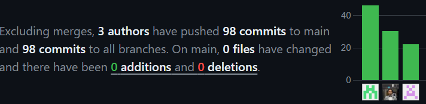
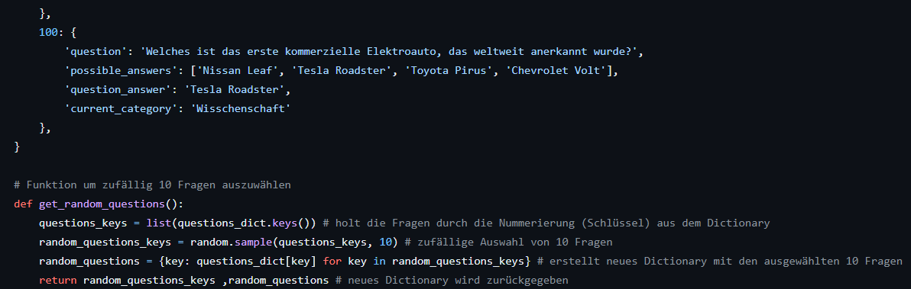
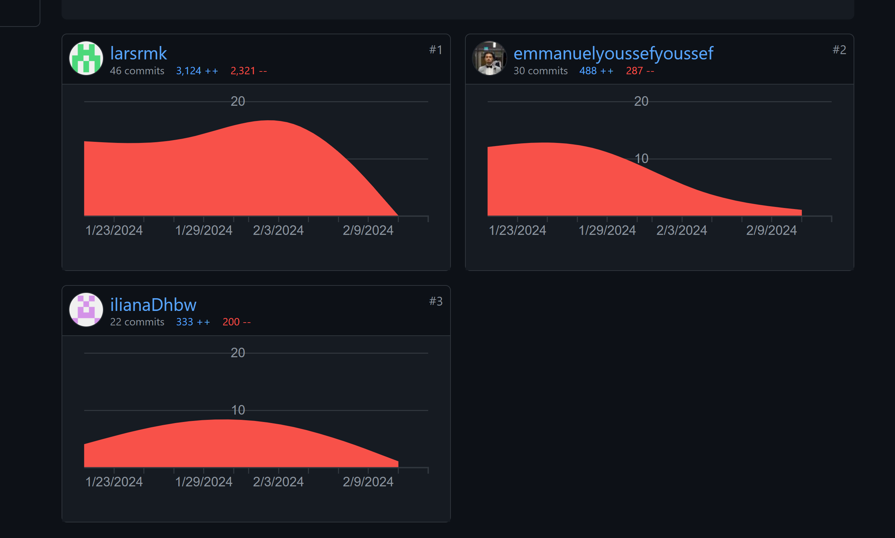
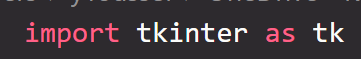
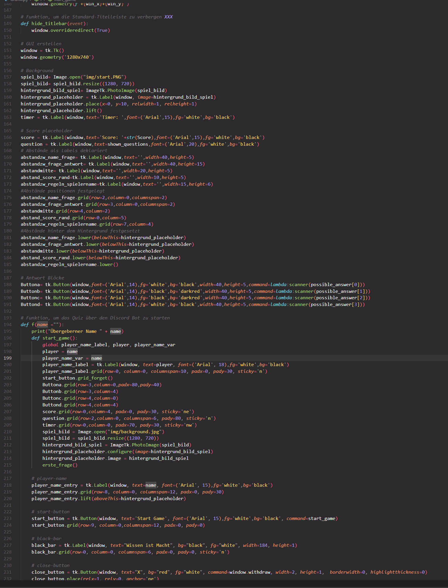
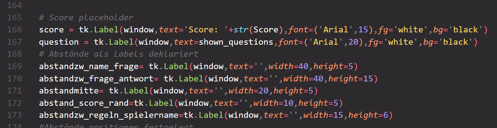
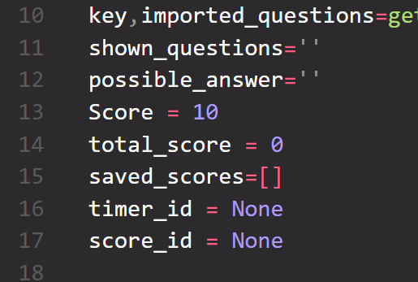
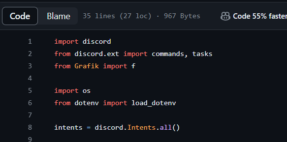
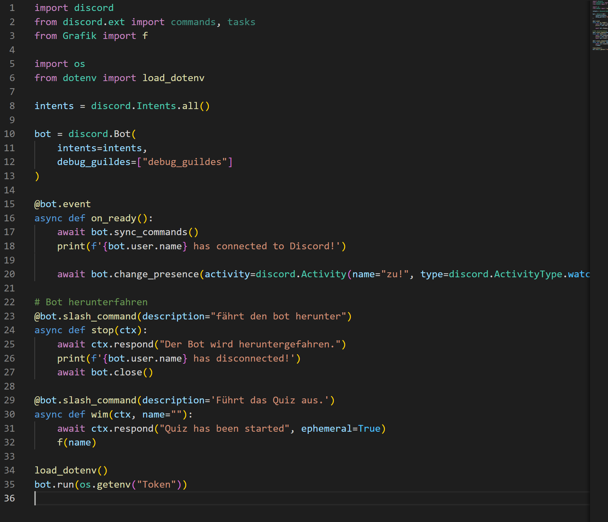

<!-- https://github.com/skills/communicate-using-markdown -->

# Grading Criteria Programmieren T3INF1004
In jedem Unterbereich werden die Punkte (gerne auch Links ins GIT) erklärt, wie das LO erreicht worden ist.
Alle Kriterien betreffen nur die Projektarbeit. Beweismaterial kommt aus dem Gruppenprojekt.

## FACHKOMPETENZ (40 Punkte)

# Die Studierenden kennen die Grundelemente der prozeduralen Programmierung. (10)
<!-- Siehe Kenntnisse in prozeduraler Programmierung: zutreffendes wählen und beweisen-->
# Algorithmus beschreibung
Der Code enthält eine Implementierung eines Quiz-Spiels, das über eine GUI läuft. Der Ablauf des Spiels wird durch verschiedene Funktionen gesteuert, wie "neue_frage()", "scanner()", "richtige_antwort()", usw. Diese Funktionen beschreiben den Ablauf des Quiz-Spiels, wie das Anzeigen neuer Fragen, das Auswerten von Antworten und die Aktualisierung des Scores.
# - Datentypen
Der Code verwendet verschiedene Datentypen wie Integer (z.B. "index", "Score"), String (z.B. "player_name_var", "shown_questions"), Listen (z.B. "possible_answer", "saved_scores") und Booleans (z.B. "switcher").
# - E/A-Operationen und Dateiverarbeitung
Der Code verwendet E/A-Operationen, um Bilder zu importieren ("from PIL import Image, ImageTk") und um Fragen aus einer externen Datei zu importieren ("imported_questions=get_random_questions()").
# - Operatoren
Der Code verwendet verschiedene Operatoren wie Zuweisungsoperator "=", Vergleichsoperatoren "==", "<=", und logische Operatoren wie "and", "or", und "not".
# - Kontrollstrukturen
Der Code verwendet verschiedene Kontrollstrukturen wie bedingte Anweisungen ("if-else"), Schleifen (z.B. "while", "for"), und Verzweigungen ("if-elif-else").
# - Funktionen
Der Code definiert mehrere Funktionen wie "hoch_timer()", "score_abzug()", "neue_frage()", usw. Diese Funktionen führen verschiedene Aufgaben aus, wie das Aktualisieren des Timers, das Reduzieren des Scores, das Anzeigen neuer Fragen, usw.
# - Stringverarbeitung
Der Code verwendet Stringverarbeitung, um Texte auf Labels anzuzeigen ("question.config(text='Falsch')", "score.config(text='Score: ' + str(Score))").
# - Strukturierte Datentypen
Der Code verwendet strukturierte Datentypen wie Listen, um Fragen und mögliche Antworten zu speichern ("imported_questions[key[index]]['question']", "possible_answer=imported_questions[key[index]]['possible_answers']").

# Sie können die Syntax und Semantik von Python (10)
<!-- Eine Stelle aus ihrem Programmieren wählen auf die sie besonders stolz sind und begründen -->

Timer und score werden beim aufrufen einer neuen Frage zurükgesetzt und ne gestartet. Am Ende werden die Scores der einzelnen Fragen zusammengerechnet. Sehr interessant aber auch ein bisschen verwirrend wie welche Funktion Funktioniert und aufgerufen wird.

# Sie können ein größeres Programm selbständig entwerfen, programmieren und auf Funktionsfähigkeit testen (Das Projekt im Team) (10)
<!-- Anhand von commits zeigen, wie jeder im Projekt einen Beitrag geleistet hat -->

# Sie kennen verschiedene Datenstrukturen und können diese exemplarisch anwenden. (10)
<!-- Eine Stelle aus dem Projekt wählen auf die sie besonders stolz sind und begründen -->

Erstellung einer dict für die Fragen und Erstellung einer zweiten dict mit für einen Durchgang des Quiz. Seh cool, dass immer direkt 10 Fragen zufällig ausgewählt wurden und dann eine neue dict mit diesen 10 Fragen in das Spiel importiert wird.

## METHODENKOMPETENZ (10 Punkte)

# Die Studierenden können eine Entwicklungsumgebung verwenden um Programme zu erstellen (10)
<!-- Beweise anbringen für Nutzen folgender Tools (können links, screenshots und screnncasts sein) -->
<!-- VSC -->
Es wurde eine IDE verwendet für das Projekt. VS Code

<!-- zB -->
<!-- GIT -->

<!-- Copilot -->

<!-- other -->

## PERSONALE UND SOZIALE KOMPETENZ (20 Punkte)

# Die Studierenden können ihre Software erläutern und begründen. (5)
<!-- Jeder in der Gruppe: You have helped someone else and taught something to a fellow student (get a support message from one person) -->
Bei der Präsentation des Programms, konnte man feststellen, dass die Gruppe ihre Software erläutern und begründen kann. Sie haben verschiedene Code-Abschnitte erklärt und die Funktionsfähigkeit des Programms gezeigt.

# Sie können existierenden Code analysieren und beurteilen. (5)
<!-- Pro Gruppe:You have critiqued another group project. Link to your critique here (another wiki page on your git) and link the project in the critique, use these evaluation criteria to critique the other project. Make sure they get a top grade after making the suggested changes -->

# Sie können sich selbstständig in Entwicklungsumgebungen und Technologien einarbeiten und diese zur Programmierung und Fehlerbehebung einsetzen. (10)
<!-- Which technology did you learn outside of the teacher given input -->
Die Gruppe hat verschiedene libaries benutzt wie zum Beispiel  und 
<!-- Did you or your group get help from someone in the classroom (get a support message here from the person who helped you) -->

## ÜBERGREIFENDE HANDLUNGSKOMPETENZ (30 Punkte)

# Die Studierenden können eigenständig Problemstellungen der Praxis analysieren und zu deren Lösung Programme entwerfen (30)
<!-- Which parts of your project are you proud of and why (describe, analyse, link) -->
<!-- Where were the problems with your implementation, timeline, functionality, team management (describe, analyse, reflect from past to future, link if relevant) -->

## Kenntnisse in prozeduraler Programmierung:

# - Algorithmenbeschreibung

# - Datentypen

# - E/A-Operationen und Dateiverarbeitung

# - Operatoren

# - Kontrollstrukturen

# - Funktionen

# - Stringverarbeitung

# - Strukturierte Datentypen

